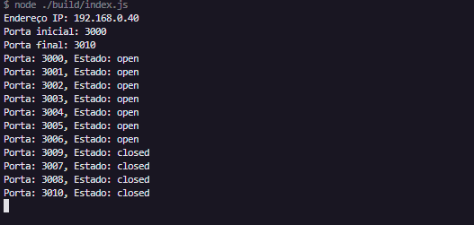

<h1 align="center">
  📑 Port Scanner - Manuel Bento
</h1>

---

## 💼 Tecnologias utilizadas

Para o desenvolvimento deste site utilizei as seguintes tecnologias:

- Node.js
- TypeScript
---

<h2>👨‍🚀 Autor</h2>

<table>
  <tr>
    <td>
      <a href="https://github.com/manuelbento19">
         
        
          <b>Manuel Bento</b>
        
      </a>
    </td>
  </tr>
</table>